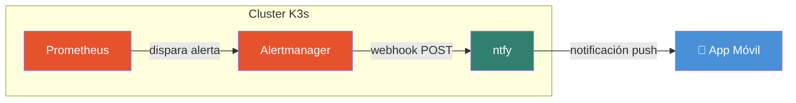
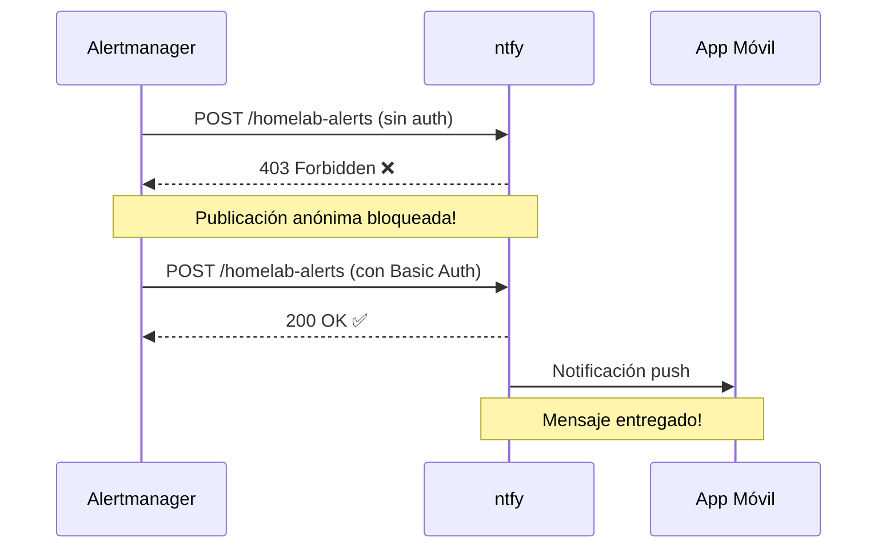
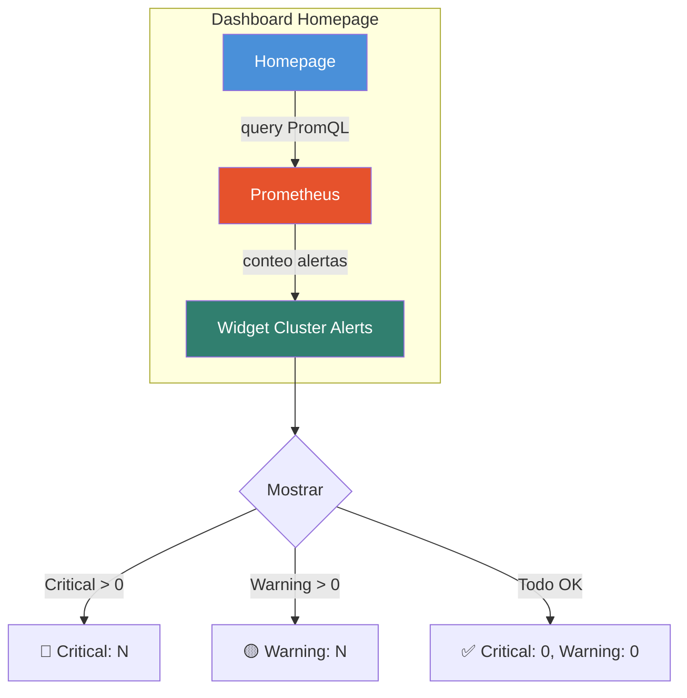

# Por Qué Mis Alertas del Homelab Fallaban Silenciosamente (Y Cómo Lo Solucioné)

*Una historia de debugging sobre autenticación, webhooks y cómo hacer que el monitoreo realmente funcione*

---

Pasé semanas pensando que el monitoreo de mi homelab funcionaba perfectamente. Prometheus recolectaba métricas, Alertmanager estaba configurado, y tenía ntfy configurado para enviar notificaciones push a mi celular. El dashboard mostraba que todo estaba saludable.

Un día, noté que mi PostgreSQL había estado caído por 3 horas. Ninguna notificación. Nada en mi celular. La alerta se había disparado — podía verla en Grafana — pero la notificación nunca me llegó.

Esta es la historia de cómo lo debuggeé y solucioné.

## El Setup

Mi homelab corre en un cluster K3s de 4 nodos. Para monitoreo, uso el Helm chart kube-prometheus-stack, que me da Prometheus, Grafana y Alertmanager listos para usar. Para notificaciones push, hosteo ntfy — un servicio simple de notificaciones pub-sub que tiene apps para iOS y Android.

La arquitectura se ve así:



Simple, ¿no? Prometheus detecta un problema, dispara una alerta a Alertmanager, que envía un webhook a ntfy, que pushea a mi celular. ¿Qué podría salir mal?

## El Síntoma

Empecé chequeando lo obvio. ¿Estaba ntfy corriendo? Sí. ¿Alertmanager estaba configurado correctamente? La config se veía bien:

```yaml
receivers:
  - name: ntfy-homelab
    webhook_configs:
      - url: http://ntfy.ntfy.svc.cluster.local/homelab-alerts
        send_resolved: true
```

Probé enviar un mensaje de prueba directamente a ntfy desde dentro del cluster:

```bash
kubectl exec -n ntfy deployment/ntfy -- \
  curl -d "Mensaje de prueba" http://localhost/homelab-alerts
```

Y obtuve esta respuesta:

```
{"code":40301,"http":403,"error":"forbidden"}
```

403 Forbidden. Pero esperá — podía suscribirme al topic desde mi celular y recibir mensajes cuando los enviaba desde fuera del cluster. ¿Por qué el request interno estaba siendo rechazado?

## Encontrando la Causa Raíz

Revisé la configuración del servidor ntfy:

```bash
kubectl exec -n ntfy deployment/ntfy -- \
  cat /etc/ntfy/server.yml | grep auth
```

Output:

```
auth-default-access: "read-only"
```

Ahí estaba. Había configurado ntfy con `auth-default-access: "read-only"` por seguridad — usuarios anónimos pueden suscribirse a topics, pero no pueden publicar. Este es un buen default para un servicio de notificaciones expuesto públicamente.

Pero Alertmanager estaba enviando webhooks como usuario anónimo. Sin headers de autenticación, sin credenciales. El request estaba siendo rechazado antes de que ntfy siquiera mirara el contenido del mensaje.



## La Solución

La solución requería tres partes:

**Parte 1: Crear credenciales para Alertmanager**

Necesitaba darle a Alertmanager un usuario y contraseña para autenticarse con ntfy. Siguiendo el principio de menor privilegio, creé un usuario dedicado `alertmanager` en lugar de usar el usuario `admin` — así el usuario solo tiene permisos para escribir en el topic `homelab-alerts`, nada más:

```bash
# Generar una contraseña segura
PASSWORD=$(openssl rand -base64 24)

# Crear usuario dedicado para Alertmanager
kubectl exec -n ntfy deployment/ntfy -- \
  sh -c "printf '%s\n%s\n' '${PASSWORD}' '${PASSWORD}' | ntfy user add alertmanager"

# Otorgar permisos SOLO al topic homelab-alerts (write-only)
kubectl exec -n ntfy deployment/ntfy -- \
  ntfy access alertmanager homelab-alerts write
```

Este enfoque tiene una ventaja de seguridad: si las credenciales se comprometen, el atacante solo puede publicar en un topic específico, no tiene acceso admin a todo ntfy.

**Parte 2: Guardar la contraseña como Kubernetes Secret**

Alertmanager puede leer credenciales desde archivos montados como secrets. Creé el secret en el namespace monitoring:

```bash
kubectl create secret generic ntfy-alertmanager-password \
  -n monitoring \
  --from-literal=password="${PASSWORD}"
```

**Parte 3: Configurar Alertmanager para usar Basic Auth**

Este fue el cambio clave en mi configuración de Terraform. Necesitaba:
1. Montar el secret en el pod de Alertmanager
2. Configurar el receiver del webhook para usar Basic Auth

```
+--------------------------------------------------+
| alertmanager.alertmanagerSpec                    |
+--------------------------------------------------+
| secrets = ["ntfy-alertmanager-password"]         |
|                                                  |
| Esto monta el secret en:                         |
| /etc/alertmanager/secrets/ntfy-alertmanager-     |
| password/password                                |
+--------------------------------------------------+

+--------------------------------------------------+
| webhook_configs                                  |
+--------------------------------------------------+
| url: http://ntfy.ntfy.svc.cluster.local/         |
|      homelab-alerts?template=alertmanager        |
|                                                  |
| http_config:                                     |
|   basic_auth:                                    |
|     username: alertmanager                       |
|     password_file: /etc/alertmanager/secrets/    |
|                    ntfy-alertmanager-password/   |
|                    password                      |
+--------------------------------------------------+
```

Notá el parámetro `?template=alertmanager` — esto le dice a ntfy que parsee el payload JSON entrante usando su template built-in de Alertmanager, que formatea la notificación de forma amigable para móviles.

## Verificando la Solución

Después de aplicar los cambios, revisé los logs de ntfy:

```bash
kubectl logs -n ntfy deployment/ntfy --tail=10 | grep messages_published
```

```
+----------------------------------------------------------+
| Hora                 | messages_published | Cambio       |
+----------------------------------------------------------+
| 2025-12-31 14:35:18  | 15                 | línea base   |
| 2025-12-31 14:40:18  | 34                 | +19          |
| 2025-12-31 14:41:18  | 43                 | +9           |
| 2025-12-31 14:46:18  | 48                 | +5           |
+----------------------------------------------------------+
```

¡El contador de mensajes estaba aumentando! Las alertas finalmente se estaban entregando.

Creé un PrometheusRule de prueba para disparar una alerta real:

```yaml
apiVersion: monitoring.coreos.com/v1
kind: PrometheusRule
metadata:
  name: test-alert
  namespace: monitoring
spec:
  groups:
    - name: test
      rules:
        - alert: TestAlertForNtfy
          expr: vector(1)
          for: 0m
          labels:
            severity: warning
          annotations:
            summary: "Alerta de prueba para integración ntfy"
```

En 30 segundos, mi celular vibró. La notificación mostraba el nombre de la alerta, severidad y descripción — exactamente lo que necesitaba.

## Bonus: Agregando un Widget de Alertas a Homepage

Mientras arreglaba las notificaciones, me di cuenta que también quería un indicador visual rápido en mi dashboard de Homepage. No quería abrir Grafana solo para ver si había alertas disparándose.

Homepage soporta un widget `prometheusmetric` que puede ejecutar queries PromQL directamente. Agregué un nuevo widget a mi sección de Cluster Health:

```yaml
- Cluster Health:
    - Cluster Alerts:
        icon: mdi-alert-circle
        href: https://grafana.chocolandiadc.com/alerting/groups
        description: "Alertas activas de Prometheus"
        widget:
          type: prometheusmetric
          url: http://kube-prometheus-stack-prometheus.monitoring.svc.cluster.local:9090
          refreshInterval: 30000
          metrics:
            - label: Critical
              query: count(ALERTS{alertstate="firing", severity="critical"}) or vector(0)
              format:
                type: number
            - label: Warning
              query: count(ALERTS{alertstate="firing", severity="warning"}) or vector(0)
              format:
                type: number
```

El `or vector(0)` es importante — sin esto, el query no retorna datos cuando hay cero alertas, y el widget muestra un error. Con esto, obtengo un "0" limpio.



Ahora puedo mirar mi dashboard e inmediatamente ver el estado de salud del cluster.

## Lecciones Aprendidas

```
+---------------------------------------------------------------+
| Lección                         | Aprendizaje                 |
+---------------------------------------------------------------+
| Testear el path completo de     | Los unit tests no alcanzan  |
| notificaciones                  | — hay que testear end-to-end|
+---------------------------------------------------------------+
| Los defaults de seguridad       | auth-default-access era     |
| pueden romper integraciones     | correcto, pero olvidé       |
|                                 | configurar la integración   |
+---------------------------------------------------------------+
| Los logs cuentan la historia    | La métrica messages_published|
|                                 | de ntfy hizo fácil debuggear|
+---------------------------------------------------------------+
| Los errores 403 necesitan       | No asumas que "forbidden"   |
| investigación                   | significa "contraseña mal"  |
+---------------------------------------------------------------+
```

La ironía no se me escapa — mi sistema de monitoreo no se estaba monitoreando a sí mismo. Tenía un punto ciego en el pipeline de notificaciones que podría haberme costado horas de downtime si algo crítico hubiera fallado.

Si estás corriendo un setup similar, te recomiendo testear tu path completo de alertas regularmente. Creá una alerta de prueba, verificá que llegue a tu celular, y borrala. Toma 30 segundos y puede salvarte de descubrir que tus notificaciones están rotas en el peor momento posible.

## Referencia Rápida

Para cualquiera implementando esto en su propio homelab, acá va un resumen:

```
+---------------------------------------------------------------+
| Componente             | Configuración                        |
+---------------------------------------------------------------+
| Modo auth de ntfy      | auth-default-access: "read-only"     |
| Usuario Alertmanager   | alertmanager (write-only homelab-alerts) |
| Storage de password    | K8s Secret en namespace monitoring   |
| Path de mount del secret| /etc/alertmanager/secrets/<nombre>/ |
| Parámetro URL webhook  | ?template=alertmanager               |
+---------------------------------------------------------------+
```

La implementación completa está en mi repositorio de homelab bajo el feature `026-ntfy-homepage-alerts`.

---

*¿Te encontraste con problemas similares de "falla silenciosa" en tu homelab? Me encantaría escuchar tus historias de debugging en los comentarios.*
