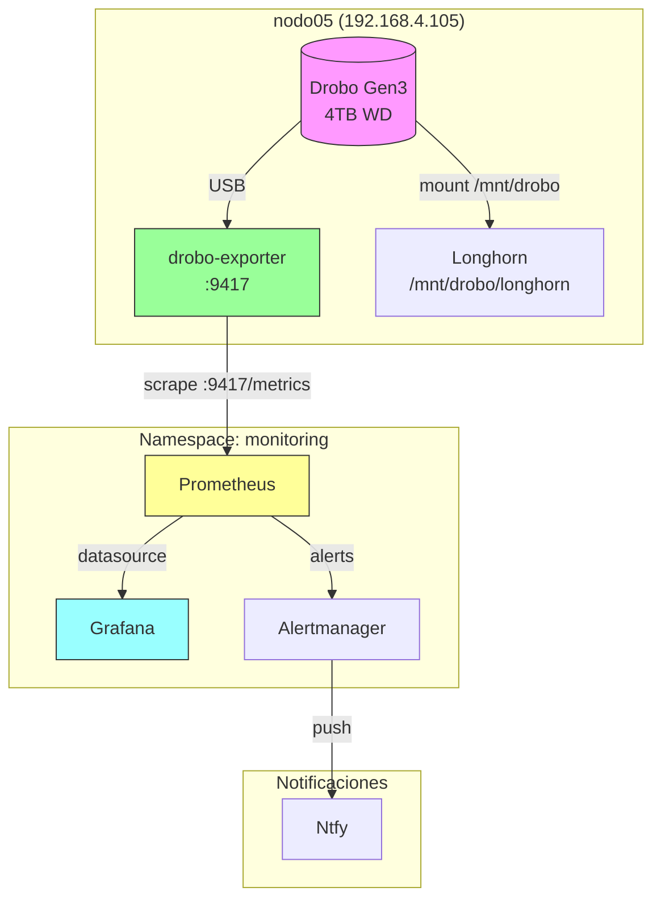
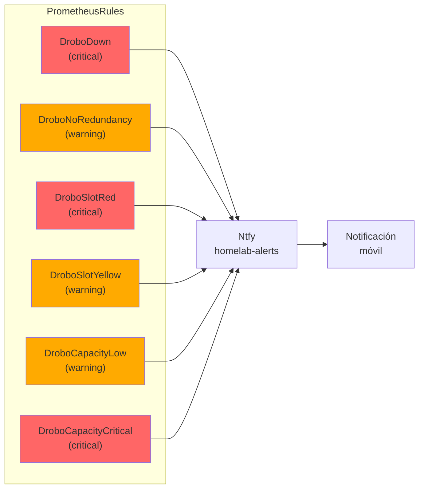

# Reviviendo un Drobo Gen3: Monitoreo con Prometheus y Grafana en Kubernetes

*3 de Enero, 2026*

## El Problema: Hardware Huérfano

Drobo, la empresa que revolucionó el almacenamiento para prosumers con su tecnología BeyondRAID, cerró sus puertas en 2023 tras declararse en bancarrota. Esto dejó a miles de usuarios con hardware funcional pero sin soporte oficial.

En mi caso, tenía un **Drobo Gen3** con un disco WD de 4TB que quería integrar a mi homelab Kubernetes. El desafío: ¿cómo monitorear un dispositivo cuyo software oficial ya no existe?

## La Búsqueda: drobo-utils

Después de investigar, encontré [drobo-utils](https://drobo-utils.sourceforge.net/), un proyecto open source creado alrededor de 2008 para gestionar Drobos desde Linux. El problema: estaba escrito para **Python 2.5/2.6**, obsoleto desde hace años.

### Los Forks Disponibles

Encontré varios forks en GitHub:

- **Original (SourceForge)**: Abandonado, Python 2.5/2.6
- **n3gwg/drobo-utils**: Fork Python 3, pero incompleto
- **petersilva/drobo-utils**: Funcional con Python 3.x

El fork de **petersilva** resultó ser el único que funcionaba correctamente con Python 3 y el Drobo Gen3.

### Instalación de drobo-utils

La instalación requiere algunos pasos manuales ya que no está disponible en PyPI:

```bash
# 1. Clonar el repositorio
git clone https://github.com/petersilva/drobo-utils.git
cd drobo-utils

# 2. Instalar dependencias del sistema (Ubuntu/Debian)
sudo apt-get install python3-parted

# 3. Copiar los archivos necesarios
sudo mkdir -p /opt/drobo-utils
sudo cp Drobo.py DroboIOctl.py drobom /opt/drobo-utils/
sudo chmod +x /opt/drobo-utils/drobom

# 4. Verificar que funciona (requiere Drobo conectado por USB)
sudo python3 /opt/drobo-utils/drobom info
```

La salida de `drobom info` muestra información detallada del dispositivo:

```
Drobo: /dev/sdb
  Firmware: 3.5.0
  Serial: DRBA12345678
  Capacity (in GB): used: 3, free: 1969, total: 1972
  DualDiskRedundancy	False

  Slot 0: WDC WD40EFRX-68N (4000 GB) status: Green
  Slot 1: empty
  Slot 2: empty
  Slot 3: empty
  Slot 4: empty
```

**Nota importante**: drobo-utils necesita acceso directo al dispositivo USB (`/dev/sdb`), por lo que debe ejecutarse con permisos de root o configurar reglas udev apropiadas.

## Arquitectura de la Solución



<details>
<summary>Ver código Mermaid</summary>


</details>

## Implementación

### 1. Preparación del Drobo

Primero, particioné y monté el Drobo en el nodo:

```bash
# Crear partición GPT de 4TB
sudo parted /dev/sdb --script mklabel gpt
sudo parted /dev/sdb --script mkpart primary ext4 0% 4TB

# Formatear con ext4
sudo mkfs.ext4 -L drobo /dev/sdb1

# Montar
sudo mkdir -p /mnt/drobo
sudo mount /dev/sdb1 /mnt/drobo

# Agregar a fstab para montaje automático
UUID=$(sudo blkid -s UUID -o value /dev/sdb1)
echo "UUID=$UUID /mnt/drobo ext4 defaults,nofail 0 2" | sudo tee -a /etc/fstab
```

### 2. El Exporter de Prometheus

Creé un exporter en Python que:

1. Ejecuta `drobom info` para obtener el estado del Drobo
2. Parsea la salida con expresiones regulares
3. Expone métricas en formato Prometheus

```python
def get_drobo_info():
    """Run drobom info and parse output"""
    result = subprocess.run(
        ['python3', '/opt/drobo-utils/drobom', 'info'],
        capture_output=True, text=True, timeout=30
    )
    return result.stdout

def parse_drobo_info(output):
    """Parse drobom info output into metrics"""
    metrics = {
        'drobo_up': 0,
        'drobo_capacity_total_bytes': 0,
        'drobo_capacity_used_bytes': 0,
        'drobo_capacity_free_bytes': 0,
        'drobo_redundancy': 0,
        'slots': []
    }

    # Parse capacity
    cap_match = re.search(
        r'Capacity \(in GB\):\s+used:\s*(\d+),\s*free:\s*(\d+),\s*total:\s*(\d+)',
        output
    )
    if cap_match:
        metrics['drobo_capacity_used_bytes'] = int(cap_match.group(1)) * 1024**3
        # ... etc

    # Parse redundancy (con whitespace flexible)
    dual_match = re.search(r'DualDiskRedundancy\s+(True|False)', output)
    if dual_match:
        metrics['drobo_redundancy'] = 1 if dual_match.group(1) == 'True' else 0

    return metrics
```

### 3. Métricas Exportadas

El exporter expone las siguientes métricas:

```
+------------------------------+-------+----------------------------------+
| Métrica                      | Tipo  | Descripción                      |
+------------------------------+-------+----------------------------------+
| drobo_up                     | Gauge | 1 si el Drobo está accesible     |
| drobo_capacity_total_bytes   | Gauge | Capacidad total en bytes         |
| drobo_capacity_used_bytes    | Gauge | Espacio usado en bytes           |
| drobo_capacity_free_bytes    | Gauge | Espacio libre en bytes           |
| drobo_redundancy             | Gauge | 1 si hay redundancia de datos    |
| drobo_slot_status            | Gauge | Estado por slot (0-3)            |
| drobo_slot_size_bytes        | Gauge | Tamaño del disco por slot        |
+------------------------------+-------+----------------------------------+

Valores de drobo_slot_status:
  0 = vacío
  1 = ok (verde)
  2 = warning (amarillo)
  3 = failed (rojo)
```

### 4. Despliegue en Kubernetes

El exporter se despliega como un DaemonSet que solo corre en el nodo con el Drobo:

```hcl
resource "kubernetes_daemon_set_v1" "drobo_exporter" {
  spec {
    template {
      spec {
        node_selector = {
          "kubernetes.io/hostname" = "nodo05"
        }

        host_network = true  # Necesario para acceder al dispositivo USB

        container {
          name  = "drobo-exporter"
          image = "python:3.12-slim"

          security_context {
            privileged = true  # Requerido para /dev/sdb
          }

          volume_mount {
            name       = "dev"
            mount_path = "/dev"
          }
        }
      }
    }
  }
}
```

El contenedor incluye los archivos de drobo-utils montados via ConfigMap y ejecuta el script del exporter al iniciar.

### 5. Integración con Longhorn

Además del monitoreo, configuré el Drobo como almacenamiento adicional para Longhorn:

```bash
# Agregar disco a Longhorn via kubectl
kubectl -n longhorn-system patch nodes.longhorn.io nodo05 --type=merge -p '{
  "spec": {
    "disks": {
      "drobo-disk": {
        "allowScheduling": true,
        "path": "/mnt/drobo/longhorn",
        "storageReserved": 107374182400,
        "tags": ["drobo", "bulk-storage"]
      }
    }
  }
}'
```

Los tags `drobo` y `bulk-storage` permiten crear StorageClasses específicas para workloads que necesiten este almacenamiento.

## Alertas Configuradas



<details>
<summary>Ver código Mermaid</summary>


</details>

Las alertas configuradas en PrometheusRules:

```
+------------------------+----------+--------------------------------+
| Alerta                 | Severidad | Condición                      |
+------------------------+----------+--------------------------------+
| DroboDown              | Critical | drobo_up == 0 por 5m           |
| DroboNoRedundancy      | Warning  | drobo_redundancy == 0 por 1h   |
| DroboSlotRed           | Critical | drobo_slot_status == 3         |
| DroboSlotYellow        | Warning  | drobo_slot_status == 2 por 5m  |
| DroboCapacityLow       | Warning  | < 15% libre por 30m            |
| DroboCapacityCritical  | Critical | < 5% libre por 5m              |
+------------------------+----------+--------------------------------+
```

## Dashboard de Grafana

El dashboard incluye:

1. **Status Overview**: Estado del Drobo, redundancia, capacidad
2. **Drive Slots**: Tabla con estado de cada bahía
3. **Capacity Distribution**: Gráfico de torta usado/libre
4. **Capacity History**: Historial de uso en el tiempo

```
+--------+--------+--------+--------+--------+--------+
| Drobo  |  Data  | Total  |  Used  |  Free  | Usage  |
| Status | Redund | Capac. |        |        |   %    |
|   UP   |   NO   |1.83TiB | 3 GiB  |1.83TiB | 0.16%  |
+--------+--------+--------+--------+--------+--------+
|  Drive Slot Status  | Capacity Dist. | Drives by Size |
|     (5 slots)       |   (pie chart)  |  (donut chart) |
+---------------------+----------------+----------------+
|           Capacity Over Time (historical graph)       |
+-------------------------------------------------------+
```

## Lecciones Aprendidas

### 1. El output de drobom tiene caracteres especiales

El output incluye tabs y caracteres no-ASCII que rompen el parsing simple:

```python
# Mal: no funciona con tabs
if 'DualDiskRedundancy False' in output:

# Bien: regex con whitespace flexible
dual_match = re.search(r'DualDiskRedundancy\s+(True|False)', output)
```

### 2. Grafana muestra valores históricos en stat panels

Si no usas `instant: true` en los queries, Grafana muestra múltiples valores del rango de tiempo:

```json
// Mal: muestra duplicados
{ "expr": "drobo_up", "refId": "A" }

// Bien: solo el valor actual
{ "expr": "drobo_up", "refId": "A", "instant": true }
```

### 3. El merge de Grafana requiere campos comunes

Para combinar datos de múltiples queries en una tabla, necesitas un campo común para el join:

```json
// Usar seriesToColumns con byField específico
{ "id": "seriesToColumns", "options": { "byField": "slot" } }
```

### 4. Privileged containers son necesarios para hardware

Acceder a dispositivos USB desde Kubernetes requiere:

- `hostNetwork: true` para el DaemonSet
- `privileged: true` en el security context
- Montar `/dev` como volumen
- Node selector para asegurar que corre en el nodo correcto

## Resultado Final

El Drobo Gen3 ahora está completamente integrado en el homelab:

- **Storage**: 3.4TB disponibles via Longhorn con tags para scheduling selectivo
- **Monitoreo**: Métricas en tiempo real en Prometheus
- **Visualización**: Dashboard dedicado en Grafana
- **Alertas**: Notificaciones push via Ntfy para cualquier problema

Todo el código está disponible en el repositorio del proyecto:

- Módulo Terraform: `terraform/modules/drobo-exporter/`
- Dashboard: `terraform/dashboards/drobo-storage.json`

## Referencias

- [drobo-utils original](https://drobo-utils.sourceforge.net/)
- [Fork funcional de petersilva](https://github.com/petersilva/drobo-utils)
- [Prometheus Python Client](https://github.com/prometheus/client_python)
- [Grafana Transformations](https://grafana.com/docs/grafana/latest/panels-visualizations/query-transform-data/transform-data/)
