# Actualizando un Cluster K3s de v1.28 a v1.33: Lecciones Aprendidas

**Fecha**: 25 de Diciembre, 2025
**Autor**: Carlos Benitez
**Tags**: K3s, Kubernetes, Homelab, DevOps, OpenTofu

---

## Introducción

Mantener un cluster de Kubernetes actualizado es una tarea crítica pero desafiante. En este artículo, documento el proceso completo de actualización de mi homelab K3s desde la versión 1.28.3 hasta la 1.33.7, incluyendo todos los componentes del ecosistema: Longhorn, Traefik, ArgoCD, cert-manager, y más.

Este upgrade no fue trivial - nos encontramos con conflictos de puertos, cambios de schema en Helm charts, y la necesidad de re-arquitecturar cómo manejamos los servicios de monitoreo.

## Arquitectura del Cluster

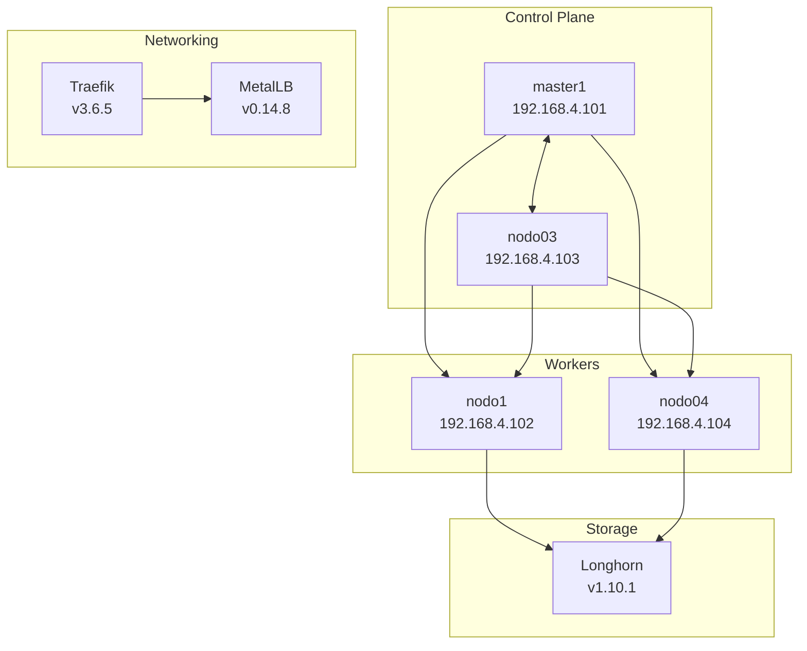

## Plan de Actualización por Fases

Dividimos el upgrade en 6 fases para minimizar el riesgo y permitir rollbacks granulares:

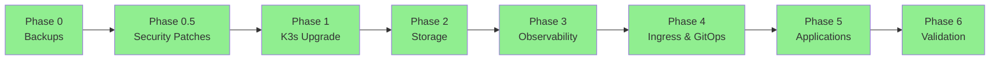

## Componentes Actualizados

| Componente | Versión Anterior | Versión Nueva | Criticidad |
|------------|------------------|---------------|------------|
| K3s | v1.28.3+k3s1 | v1.33.7+k3s1 | Alta |
| Kernel | 6.8.0-87/88 | 6.8.0-90 | Alta |
| Longhorn | 1.5.5 | 1.10.1 | Crítica |
| cert-manager | v1.13.3 | v1.19.2 | Media |
| Traefik | 30.0.2 (v3.1.0) | 38.0.1 (v3.6.5) | Media |
| ArgoCD | 5.51.0 (v2.9.0) | 7.9.0 (v2.14.11) | Alta |

---

## Desafío #1: El Conflicto del Puerto 9100

### El Problema

Durante el upgrade de K3s, nos encontramos con un error crítico que impedía que Prometheus recolectara métricas:

```
Error: listen tcp :9100: bind: address already in use
```

El puerto 9100 es utilizado por `node-exporter` de Prometheus para exponer métricas del sistema. Sin embargo, algo más estaba ocupando ese puerto.

### Diagnóstico

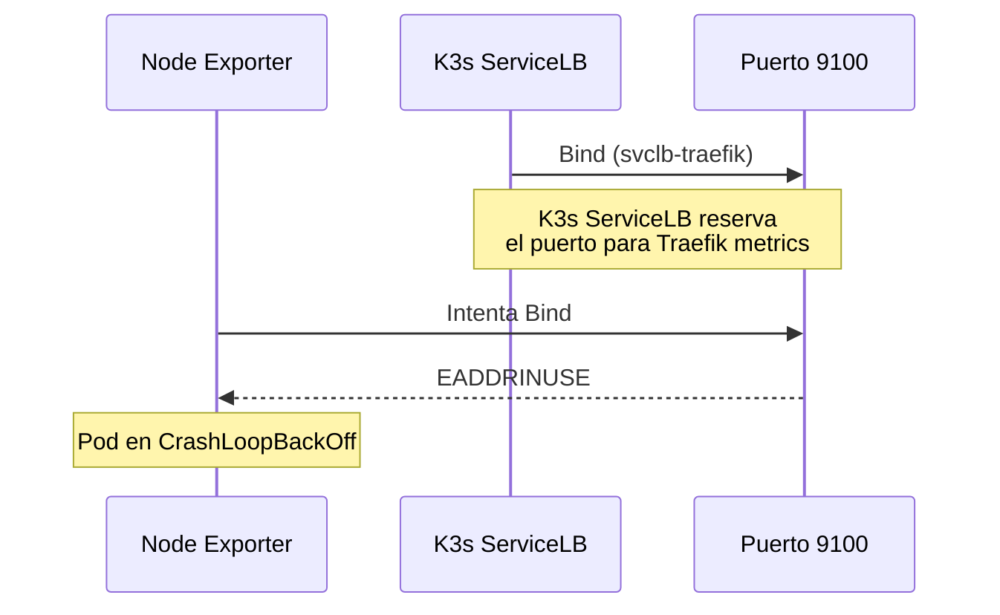

Investigando con `ss -tlnp | grep 9100`, descubrimos que K3s ServiceLB (Klipper) estaba creando un DaemonSet `svclb-traefik` que reservaba el puerto 9100 en todos los nodos para exponer las métricas de Traefik.

### La Solución

El problema era que teníamos **dos sistemas de LoadBalancer compitiendo**:
1. **MetalLB**: Nuestro LoadBalancer principal (correctamente configurado)
2. **K3s ServiceLB (Klipper)**: El LoadBalancer integrado de K3s (debería estar deshabilitado)

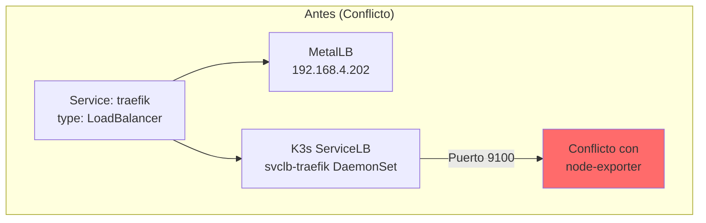

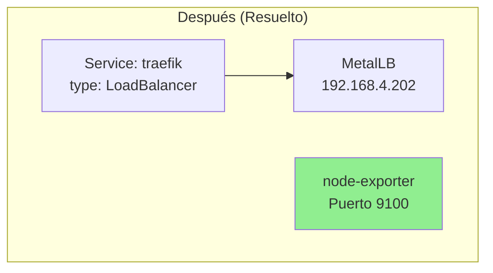

**Comandos ejecutados:**

```bash
# Identificar el problema
kubectl get ds -A | grep svclb
# NAMESPACE   NAME            DESIRED   CURRENT   READY
# traefik     svclb-traefik   4         4         4

# Eliminar el DaemonSet conflictivo
kubectl delete ds svclb-traefik -n traefik

# Verificar que node-exporter ahora funciona
kubectl get pods -n monitoring | grep node-exporter
# prometheus-node-exporter-xxxxx   1/1     Running
```

### Lección Aprendida

Cuando usas MetalLB en K3s, debes asegurarte de que K3s ServiceLB esté completamente deshabilitado. La anotación `svccontroller.k3s.cattle.io/enablelb: "false"` debe estar en todos los servicios LoadBalancer, y es recomendable iniciar K3s con `--disable servicelb`.

---

## Desafío #2: Cambios de Schema en Traefik Chart 38.x

### El Problema

Al actualizar Traefik de la versión 30.0.2 a 38.0.1, el `helm upgrade` falló con múltiples errores de validación:

```
Error: values don't meet the specifications of the schema(s):
- serviceAccount: Additional property create is not allowed
- readinessProbe: Additional property httpGet is not allowed
- livenessProbe: Additional property httpGet is not allowed
```

### Diagnóstico

El chart de Traefik 38.x introdujo cambios significativos en el schema de valores:

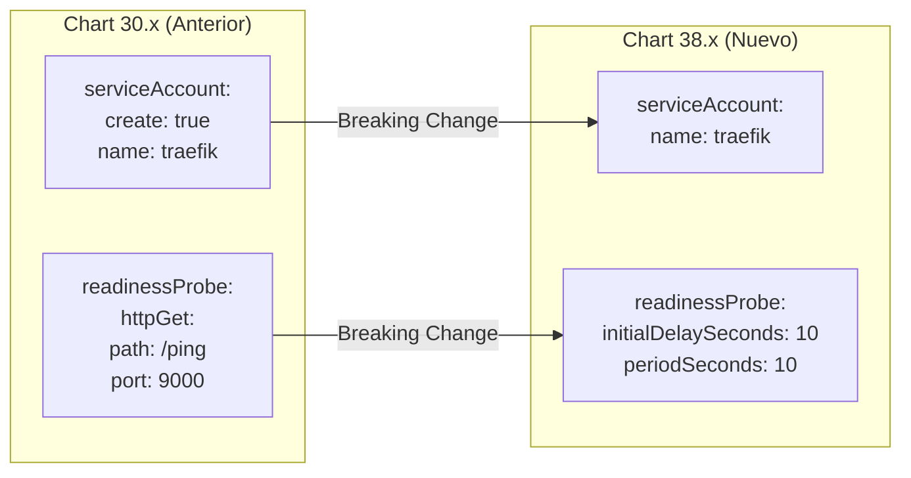

### La Solución

Tuvimos que actualizar nuestro `values.yaml` para cumplir con el nuevo schema:

**Antes (Chart 30.x):**
```yaml
serviceAccount:
  create: true
  name: "traefik"

readinessProbe:
  httpGet:
    path: /ping
    port: 9000
  initialDelaySeconds: 10

livenessProbe:
  httpGet:
    path: /ping
    port: 9000
  initialDelaySeconds: 10
```

**Después (Chart 38.x):**
```yaml
# Service Account - chart 38.x maneja creation internamente
serviceAccount:
  name: ""  # Vacío = auto-crear con fullname template

# Health checks - chart 38.x determina el tipo de probe internamente
readinessProbe:
  initialDelaySeconds: 10
  periodSeconds: 10
  timeoutSeconds: 2
  successThreshold: 1
  failureThreshold: 3

livenessProbe:
  initialDelaySeconds: 10
  periodSeconds: 10
  timeoutSeconds: 2
  successThreshold: 1
  failureThreshold: 3
```

### Lección Aprendida

Siempre revisar el `CHANGELOG.md` y los breaking changes antes de actualizar charts de Helm con saltos de versión mayores. El comando `helm show values traefik/traefik --version 38.0.1` es invaluable para comparar schemas.

---

## Desafío #3: Upgrade de Longhorn con Volúmenes Activos

### El Problema

Longhorn es nuestro sistema de almacenamiento distribuido. Actualizarlo de 1.5.5 a 1.10.1 (un salto de 5 versiones menores) requería especial cuidado ya que teníamos volúmenes con datos de producción.

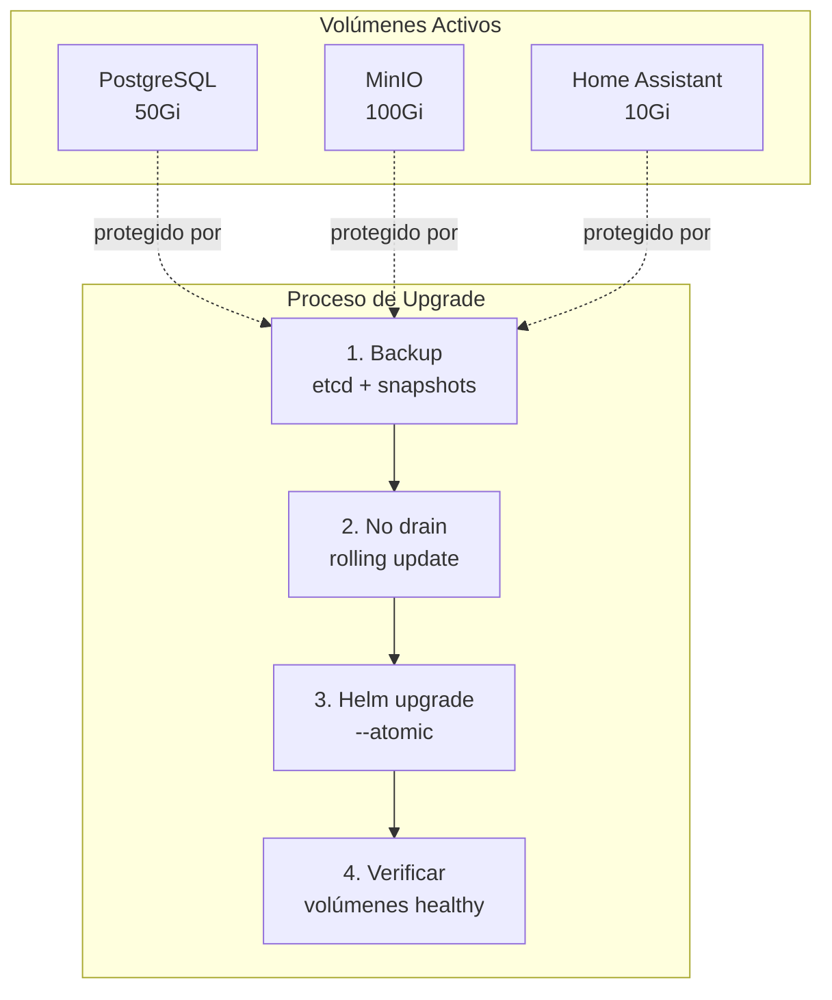

### La Solución

1. **Backup completo antes del upgrade:**
```bash
# Backup de etcd
kubectl exec -n kube-system etcd-master1 -- \
  etcdctl snapshot save /tmp/etcd-backup.db

# Verificar estado de volúmenes
kubectl -n longhorn-system get volumes.longhorn.io
```

2. **Upgrade con protección:**
```bash
helm upgrade longhorn longhorn/longhorn \
  --namespace longhorn-system \
  --version 1.10.1 \
  --atomic \
  --timeout 10m
```

3. **Verificación post-upgrade:**
```bash
# Todos los volúmenes deben estar "attached" y "healthy"
kubectl -n longhorn-system get volumes.longhorn.io
# NAME                                       STATE      ROBUSTNESS
# pvc-ed7ac428-...                          attached   healthy
```

### Lección Aprendida

Longhorn tiene excelente soporte para upgrades in-place. El flag `--atomic` en Helm es crucial - si algo falla, automáticamente hace rollback al estado anterior.

---

## Pinning de Imágenes: Eliminando el Antipatrón "latest"

Uno de los objetivos del audit era eliminar el uso de tags `latest` y `stable`, que son antipatrones en producción.

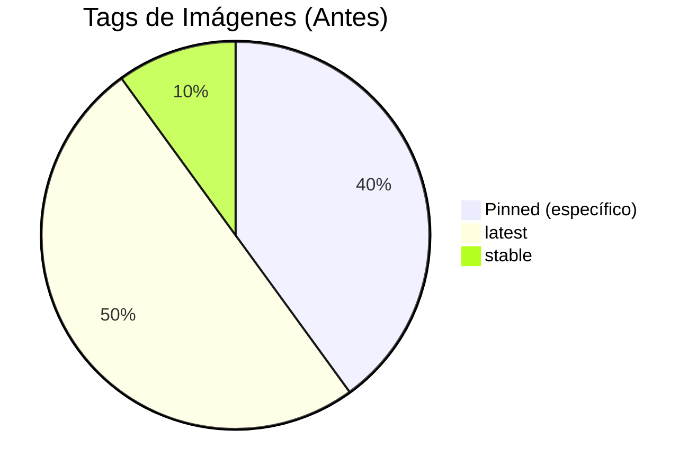

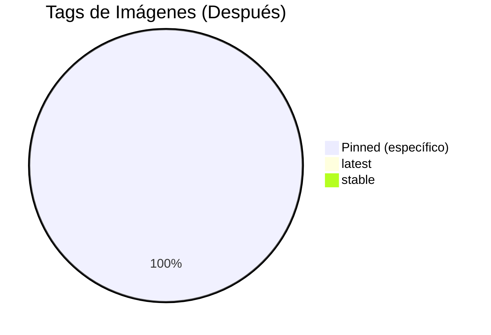

### Imágenes Actualizadas

| Imagen | Tag Anterior | Tag Nuevo |
|--------|--------------|-----------|
| pihole/pihole | latest | 2025.11.1 |
| gethomepage/homepage | latest | v1.4.6 |
| sonatype/nexus3 | latest | 3.87.1 |
| cloudflare/cloudflared | latest | 2025.11.1 |
| localstack/localstack | latest | 4.10.0 |
| home-assistant | stable | 2025.12.4 |

---

## Timeline del Upgrade

```mermaid
gantt
    title Cluster Upgrade Timeline
    dateFormat  HH:mm
    axisFormat %H:%M

    section Phase 0
    Backups & Preparation     :done, p0, 14:00, 30m

    section Phase 0.5
    Ubuntu Security Patches   :done, p05, 14:30, 45m

    section Phase 1
    K3s v1.28 → v1.33        :done, p1, 15:15, 60m

    section Phase 2
    Longhorn 1.5.5 → 1.10.1  :done, p2, 16:15, 45m

    section Phase 3
    cert-manager Upgrade      :done, p3a, 17:00, 20m
    Port 9100 Fix            :crit, done, p3b, 17:20, 30m

    section Phase 4
    Traefik Schema Fix       :crit, done, p4a, 17:50, 25m
    ArgoCD Upgrade           :done, p4b, 18:15, 15m

    section Phase 5
    Image Tag Pinning        :done, p5, 18:30, 20m

    section Phase 6
    Validation & Docs        :done, p6, 18:50, 30m
```

---

## Resultado Final

### Estado del Cluster Post-Upgrade

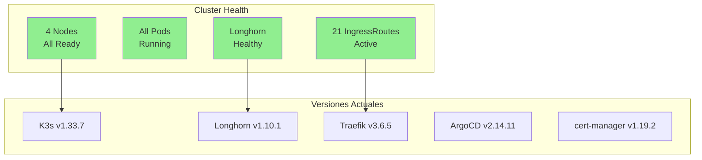

### Métricas de Éxito

- **Zero Downtime**: Los servicios críticos nunca se interrumpieron
- **Zero Data Loss**: Todos los volúmenes persistentes intactos
- **100% Nodes Ready**: Los 4 nodos funcionando correctamente
- **21 IngressRoutes**: Todas las rutas de ingreso operativas
- **4 LoadBalancer IPs**: MetalLB sirviendo correctamente

---

## Componentes Diferidos

Algunos upgrades fueron diferidos por ser de baja prioridad o requerir planificación adicional:

| Componente | Versión Actual | Target | Razón del Diferimiento |
|------------|----------------|--------|------------------------|
| kube-prometheus-stack | 55.5.0 | 80.6.0 | Upgrade complejo, requiere feature separado |
| Redis | 23.2.12 | 24.1.0 | Estable, bajo riesgo |
| PostgreSQL | 18.1.9 | 18.2.0 | Estable, bajo riesgo |
| MetalLB | 0.14.8 | 0.15.3 | Deployed via kubectl, no Helm |

---

## Conclusiones

### Lo que Funcionó Bien

1. **Enfoque por fases**: Dividir el upgrade en fases pequeñas permitió identificar y resolver problemas de forma aislada
2. **Backups exhaustivos**: Tener snapshots de etcd y Longhorn nos dio confianza para proceder
3. **OpenTofu/Terraform**: La infraestructura como código facilitó trackear todos los cambios
4. **Atomic upgrades**: El flag `--atomic` de Helm previno estados inconsistentes

### Lo que Mejoraríamos

1. **Deshabilitar K3s ServiceLB desde el inicio**: Esto habría evitado el conflicto del puerto 9100
2. **Revisar changelogs antes de upgrades mayores**: El cambio de schema de Traefik nos tomó por sorpresa
3. **Automatizar validación post-upgrade**: Scripts que verifiquen automáticamente el estado del cluster

### Próximos Pasos

1. Crear feature para upgrade de kube-prometheus-stack a 80.6.0
2. Implementar alertas para detectar uso de tags `latest`
3. Documentar procedimiento de rollback para cada componente

---

## Actualización: Upgrades de Prioridad Media (26 de Diciembre, 2025)

Un día después del upgrade principal, completamos los componentes de prioridad media que habían quedado pendientes.

### Componentes Actualizados

| Componente | Versión Anterior | Versión Nueva | Función |
|------------|------------------|---------------|---------|
| **ntfy** | v2.8.0 | v2.15.0 | Push notifications para alertas |
| **MinIO** | RELEASE.2024-01-01 | RELEASE.2025-01-20 | Object storage S3-compatible |
| **MetalLB** | 0.14.8 | 0.15.3 | LoadBalancer para bare-metal |

### Desafío #4: Migración de MetalLB a Helm

MetalLB presentó el desafío más interesante. Originalmente fue desplegado con `kubectl apply`, pero queríamos migrarlo a gestión via Helm para consistencia con el resto del cluster.

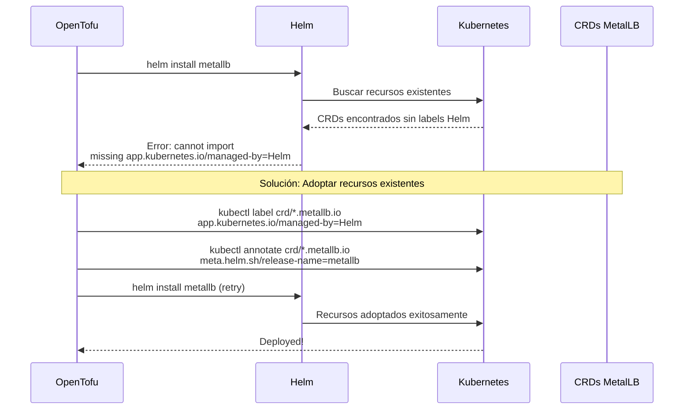

El problema era que Helm no puede "adoptar" recursos existentes a menos que tengan las etiquetas correctas:

```bash
# Error original
Error: CustomResourceDefinition "ipaddresspools.metallb.io" exists and
cannot be imported: missing key "app.kubernetes.io/managed-by": must be set to "Helm"

# Solución: Etiquetar los 7 CRDs + recursos relacionados
kubectl label crd bfdprofiles.metallb.io bgpadvertisements.metallb.io \
  bgppeers.metallb.io communities.metallb.io ipaddresspools.metallb.io \
  l2advertisements.metallb.io servicel2statuses.metallb.io \
  app.kubernetes.io/managed-by=Helm --overwrite

kubectl annotate crd bfdprofiles.metallb.io bgpadvertisements.metallb.io \
  bgppeers.metallb.io communities.metallb.io ipaddresspools.metallb.io \
  l2advertisements.metallb.io servicel2statuses.metallb.io \
  meta.helm.sh/release-name=metallb \
  meta.helm.sh/release-namespace=metallb-system --overwrite
```

### Desafío #5: Volúmenes RWO Durante Rolling Update de MinIO

MinIO usa un PersistentVolumeClaim con `ReadWriteOnce` (RWO). Durante un rolling update normal, Kubernetes intenta crear el nuevo pod antes de terminar el viejo, causando un deadlock:

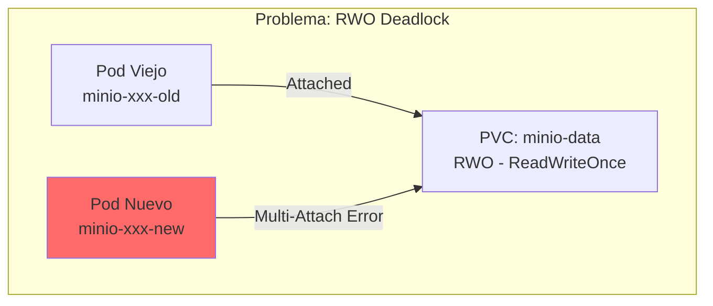

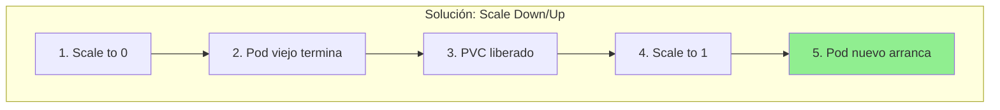

**Comandos ejecutados:**
```bash
# Escalar a 0 para liberar el volumen
kubectl scale deployment minio -n minio --replicas=0

# Esperar que termine
kubectl wait --for=delete pod -l app=minio -n minio --timeout=60s

# Escalar de vuelta
kubectl scale deployment minio -n minio --replicas=1
```

### Estado Final de LoadBalancer Services

Después de los upgrades, verificamos que todos los servicios LoadBalancer mantienen sus IPs asignadas:

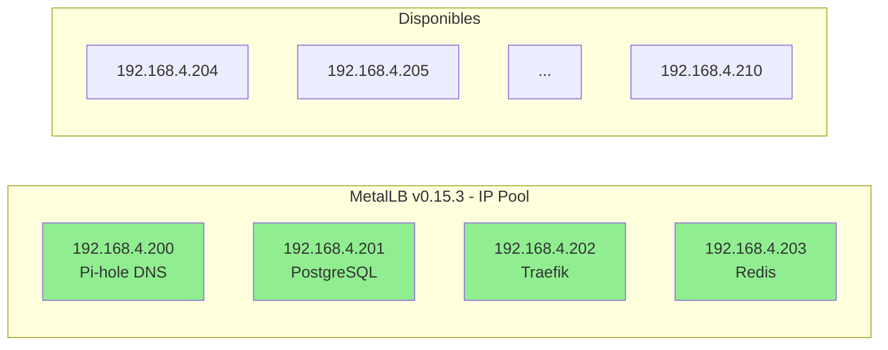

### Resumen de Mejoras de Código

Como parte de estos upgrades, también mejoramos la infraestructura como código:

1. **MinIO**: Convertimos la imagen hardcodeada a una variable de Terraform para facilitar futuros upgrades
2. **ntfy**: Eliminamos el tag `latest` del default y lo pinneamos a una versión específica
3. **MetalLB**: Migramos de kubectl manifests a módulo Terraform con Helm release

```hcl
# Antes (hardcoded)
image = "quay.io/minio/minio:RELEASE.2024-01-01T16-36-33Z"

# Después (variable)
variable "minio_image" {
  default = "quay.io/minio/minio:RELEASE.2025-01-20T14-49-07Z"
}
image = var.minio_image
```

### Lecciones Adicionales

1. **Helm Adoption**: Cuando migras recursos de kubectl a Helm, necesitas etiquetar todos los recursos existentes con los labels de Helm ownership antes de hacer el install
2. **RWO Volumes**: Para deployments con volúmenes RWO, considera usar `strategy.type: Recreate` en lugar de `RollingUpdate`
3. **Environment Overrides**: Siempre verifica si el environment está sobreescribiendo valores del módulo - el problema del ntfy que seguía en v2.8.0 se debía a esto

---

## Referencias

- [K3s Release Notes v1.33](https://github.com/k3s-io/k3s/releases/tag/v1.33.7%2Bk3s1)
- [Longhorn Upgrade Guide](https://longhorn.io/docs/1.10.1/deploy/upgrade/)
- [Traefik Helm Chart Migration](https://github.com/traefik/traefik-helm-chart/releases)
- [ArgoCD Upgrade Notes](https://argo-cd.readthedocs.io/en/stable/operator-manual/upgrading/overview/)

---

*Este artículo fue escrito como parte de la documentación del proyecto chocolandia_kube, un homelab K3s que sirve como laboratorio de aprendizaje y experimentación con tecnologías cloud-native.*
