# Diagramas Mermaid para el Blog

Usa https://mermaid.live/ para convertir a PNG/SVG

---

## Diagrama 1: Arquitectura General (architecture-diagram.png)

```mermaid
flowchart TB
    subgraph Kubernetes["Cluster K3s"]
        NE["node_exporter<br/>🌡️ CPU Temp"]
        PROM["Prometheus<br/>📊 Metrics DB"]
        GRAF["Grafana<br/>📈 Dashboards"]
        HA["Home Assistant<br/>🏠 Automation"]
        MOSQ["Mosquitto<br/>📨 MQTT Broker"]
        G2M["govee2mqtt<br/>🔌 Bridge"]
    end

    subgraph Physical["Hardware"]
        GOVEE["Govee H5083<br/>🔌 Smart Plug"]
        FAN["Ventilador<br/>💨 Rack Cooling"]
    end

    NE -->|"scrape"| PROM
    PROM -->|"visualize"| GRAF
    PROM -->|"ha-prometheus-sensor"| HA
    HA -->|"MQTT command"| MOSQ
    MOSQ -->|"publish"| G2M
    G2M -->|"WiFi/LAN"| GOVEE
    GOVEE -->|"power"| FAN

    style NE fill:#e74c3c,color:#fff
    style PROM fill:#e67e22,color:#fff
    style GRAF fill:#f39c12,color:#fff
    style HA fill:#3498db,color:#fff
    style MOSQ fill:#9b59b6,color:#fff
    style G2M fill:#1abc9c,color:#fff
    style GOVEE fill:#2ecc71,color:#fff
    style FAN fill:#95a5a6,color:#fff
```

---

## Diagrama 2: Flujo de Automatizacion (automation-flow.png)

```mermaid
flowchart LR
    subgraph Trigger["Trigger"]
        TEMP["CPU Temp<br/>Sensor"]
    end

    subgraph Condition["Condicion"]
        CHECK{{"Temp >= 50°C?"}}
    end

    subgraph Action["Accion"]
        ON["switch.turn_on<br/>Govee Plug"]
        OFF["switch.turn_off<br/>Govee Plug"]
    end

    subgraph Result["Resultado"]
        FAN_ON["🌀 Fan ON"]
        FAN_OFF["⭕ Fan OFF"]
    end

    TEMP --> CHECK
    CHECK -->|"Si >= 50°C"| ON
    CHECK -->|"Si < 49°C"| OFF
    ON --> FAN_ON
    OFF --> FAN_OFF

    style TEMP fill:#3498db,color:#fff
    style CHECK fill:#f39c12,color:#fff
    style ON fill:#2ecc71,color:#fff
    style OFF fill:#e74c3c,color:#fff
    style FAN_ON fill:#27ae60,color:#fff
    style FAN_OFF fill:#7f8c8d,color:#fff
```

---

## Diagrama 3: Stack de Componentes (stack-diagram.png)

```mermaid
flowchart TB
    subgraph Monitoring["📊 Monitoreo"]
        direction TB
        NE["node_exporter"]
        PROM["Prometheus"]
        GRAF["Grafana"]
    end

    subgraph Automation["🏠 Automatizacion"]
        direction TB
        HA["Home Assistant"]
        HACS["HACS"]
        HAPROM["ha-prometheus-sensor"]
    end

    subgraph IoT["📡 IoT Communication"]
        direction TB
        MOSQ["Mosquitto MQTT"]
        G2M["govee2mqtt"]
    end

    subgraph Hardware["🔌 Hardware"]
        GOVEE["Govee H5083"]
    end

    Monitoring --> Automation
    Automation --> IoT
    IoT --> Hardware

    style Monitoring fill:#2c3e50,color:#fff
    style Automation fill:#2980b9,color:#fff
    style IoT fill:#8e44ad,color:#fff
    style Hardware fill:#27ae60,color:#fff
```

---

## Diagrama 4: Secuencia de Eventos (sequence-diagram.png)

```mermaid
sequenceDiagram
    participant NE as node_exporter
    participant P as Prometheus
    participant HA as Home Assistant
    participant M as Mosquitto
    participant G as govee2mqtt
    participant Plug as Govee H5083

    Note over NE,Plug: Temperatura sube a 50°C

    NE->>P: Metric: temp=50°C
    P->>HA: Query via ha-prometheus-sensor
    HA->>HA: Trigger: temp >= 50
    HA->>M: MQTT: switch/on
    M->>G: Publish message
    G->>Plug: API/LAN: turn_on
    Plug->>Plug: 🌀 Fan starts

    Note over NE,Plug: Temperatura baja a 48°C

    NE->>P: Metric: temp=48°C
    P->>HA: Query via ha-prometheus-sensor
    HA->>HA: Trigger: temp < 49
    HA->>M: MQTT: switch/off
    M->>G: Publish message
    G->>Plug: API/LAN: turn_off
    Plug->>Plug: ⭕ Fan stops
```

---

## Instrucciones

1. Ve a https://mermaid.live/
2. Pega cada bloque de codigo (sin los backticks)
3. Ajusta colores/tamano si queres
4. Click en "Actions" → "Download PNG" o "Download SVG"
5. Subi las imagenes a Medium y reemplaza los placeholders [INSERTAR IMAGEN: ...]
