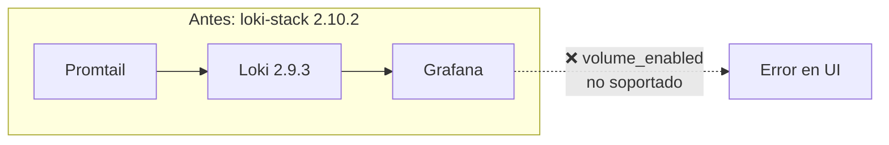
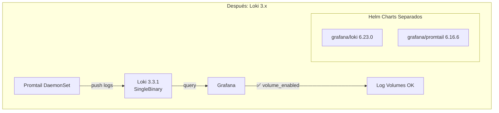
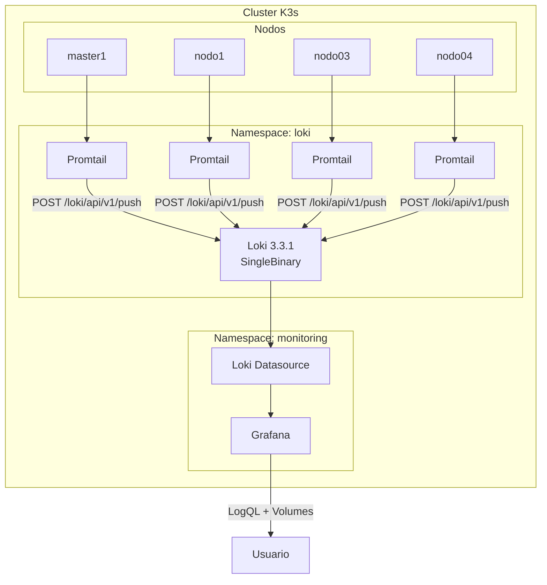

# Migrando Loki de 2.x a 3.x en Kubernetes: Habilitando Log Volumes para Grafana

## El Problema

Todo comenzó con un mensaje frustrante en Grafana:

```
Log volume has not been configured.
Instructions to enable volume in the Loki config:
limits_config:
  volume_enabled: true
```

Parecía simple: agregar una línea de configuración. Pero la realidad fue diferente.

## El Contexto

En mi homelab corro un cluster K3s con Loki para centralizar logs. Usaba el chart `loki-stack` que es conveniente porque incluye Loki + Promtail en un solo paquete.



## El Primer Intento (Fallido)

Agregué la configuración sugerida:

```yaml
loki:
  config:
    limits_config:
      volume_enabled: true
```

Resultado: **CrashLoopBackOff**

```
field volume_enabled not found in type validation.plain
```

El problema: `volume_enabled` es una feature de **Loki 3.x**, pero `loki-stack` solo soporta hasta Loki 2.9.3.

## La Solución: Migrar a Loki 3.x

No había otra opción. Tenía que migrar del chart `loki-stack` al chart `loki` oficial de Grafana.



## Comparación de Charts

```
+------------------+------------------------+---------------------------+
| Aspecto          | loki-stack             | grafana/loki + promtail   |
+------------------+------------------------+---------------------------+
| Versión Loki     | 2.9.3                  | 3.3.1                     |
| Charts           | 1 (bundled)            | 2 (separados)             |
| volume_enabled   | ❌ No soportado        | ✅ Soportado              |
| Modo deployment  | StatefulSet simple     | SingleBinary/Distributed  |
| Schema           | v11                    | v13 (TSDB)                |
+------------------+------------------------+---------------------------+
```

## Configuración Clave para SingleBinary

Para un homelab, el modo `SingleBinary` es ideal: un solo pod que hace todo, sin necesidad de object storage externo.

```hcl
# terraform/modules/loki/main.tf
resource "helm_release" "loki" {
  name       = "loki"
  repository = "https://grafana.github.io/helm-charts"
  chart      = "loki"
  version    = "6.23.0"

  values = [
    yamlencode({
      deploymentMode = "SingleBinary"

      loki = {
        auth_enabled = false

        storage = {
          type = "filesystem"  # Sin MinIO/S3
        }

        schemaConfig = {
          configs = [{
            from         = "2024-01-01"
            store        = "tsdb"      # Nuevo en 3.x
            schema       = "v13"       # Mejor performance
            object_store = "filesystem"
            index = {
              prefix = "index_"
              period = "24h"
            }
          }]
        }

        limits_config = {
          volume_enabled = true  # 🎯 La razón de todo esto
        }
      }

      # Deshabilitar modos distribuidos
      read    = { replicas = 0 }
      write   = { replicas = 0 }
      backend = { replicas = 0 }

      singleBinary = {
        replicas = 1
        persistence = {
          enabled          = true
          size             = "10Gi"
          storageClassName = "longhorn"
        }
      }
    })
  ]
}
```

## Los Errores que Encontré

### Error 1: Campo inválido

```
field enforce_metric_name not found in type validation.plain
```

**Solución**: Eliminar `enforce_metric_name` — fue deprecado en Loki 3.x.

### Error 2: Compactor mal configurado

```
CONFIG ERROR: compactor.delete-request-store should be configured
when retention is enabled
```

**Solución**: Configurar el compactor correctamente:

```yaml
compactor:
  retention_enabled: true
  delete_request_store: "filesystem"  # Requerido en 3.x
  working_directory: "/var/loki/compactor"
```

## Arquitectura Final



## Resultado

```
$ kubectl get pods -n loki

NAME             READY   STATUS
loki-0           2/2     Running
promtail-7vg44   1/1     Running
promtail-gt6p7   1/1     Running
promtail-pvmxp   1/1     Running
promtail-rqb7d   1/1     Running
```

Y en Grafana, los log volumes ahora funcionan correctamente, mostrando histogramas de frecuencia de logs por label.

## Lecciones Aprendidas

1. **Leer changelogs**: `volume_enabled` fue introducido en Loki 3.0. El chart `loki-stack` quedó en 2.x.

2. **SingleBinary para homelabs**: No necesitás MinIO ni arquitectura distribuida para un cluster pequeño.

3. **Los errores guían**: Cada CrashLoopBackOff me acercó a la configuración correcta.

4. **Terraform/OpenTofu ayudan**: Tener la infraestructura como código facilitó iterar rápido.

## Recursos

- [Loki 3.0 Release Notes](https://grafana.com/docs/loki/latest/release-notes/v3-0/)
- [Helm Chart grafana/loki](https://github.com/grafana/loki/tree/main/production/helm/loki)
- [SingleBinary Mode](https://grafana.com/docs/loki/latest/setup/install/helm/install-monolithic/)

---

*Este artículo es parte de mi serie sobre infraestructura homelab con K3s, OpenTofu y GitOps.*
